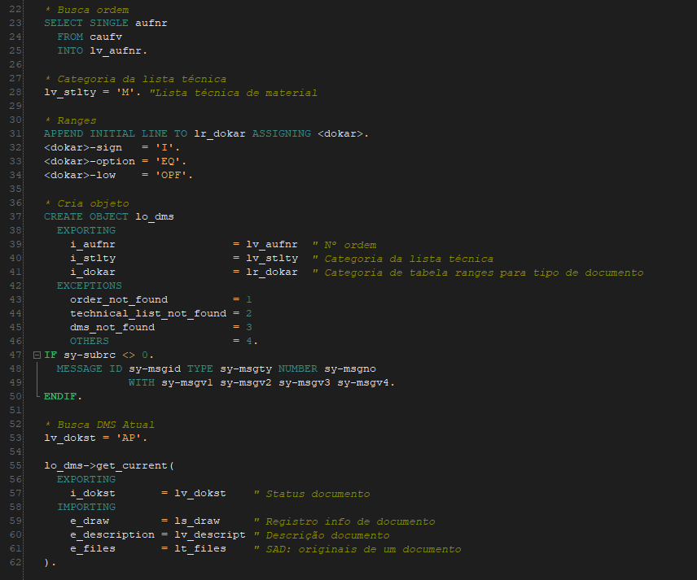

# Obtêm documento DMS através do número da ordem
 Classe para obter documento DMS através de ordem de produção.
 
 A classe busca o documento DMS a partir o número da ordem de produção, sendo necessário informar a categoria da lista técnica.
 
 [Link programa de exemplo utilizando a classe](src/zdms_example.prog.abap)
 
 ## Exemplo de uso
 
 
